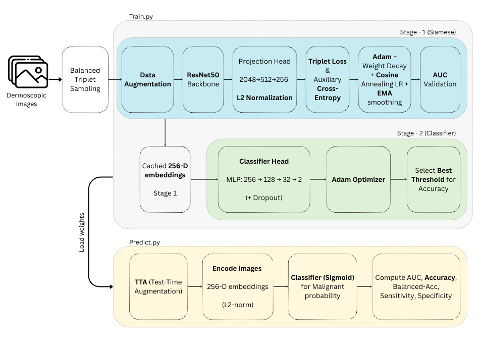
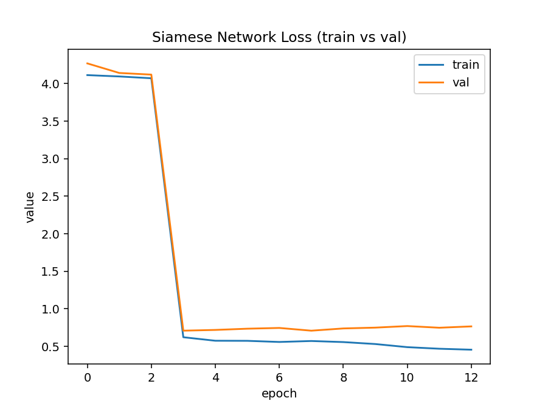
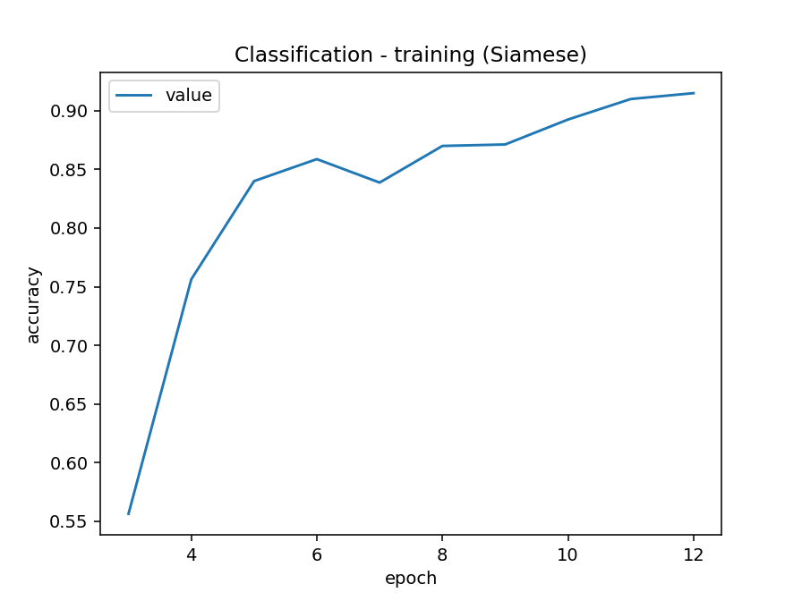
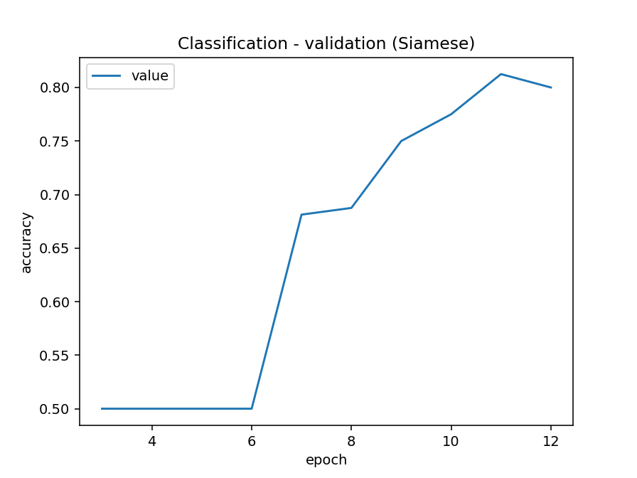
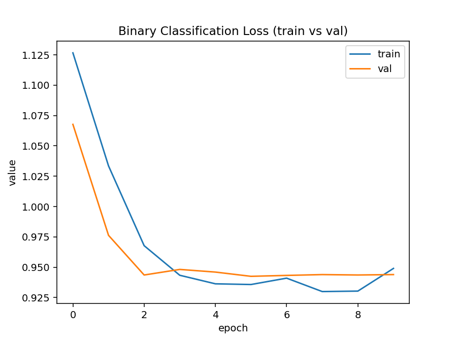
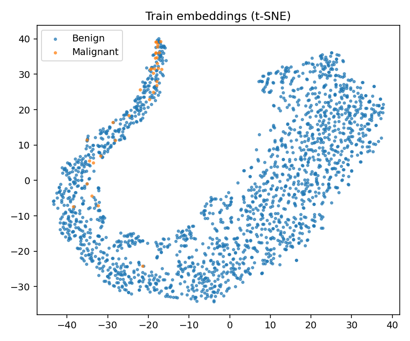
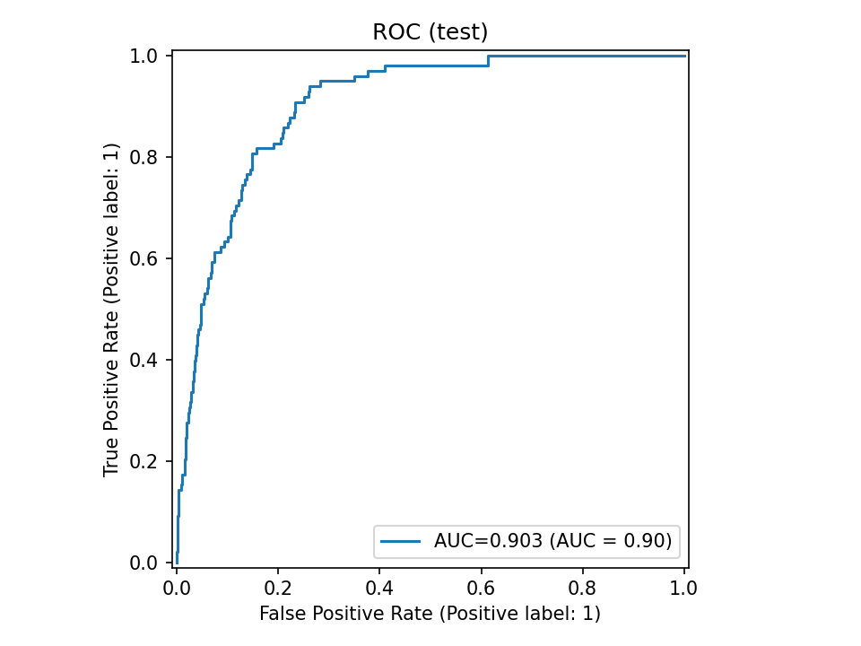
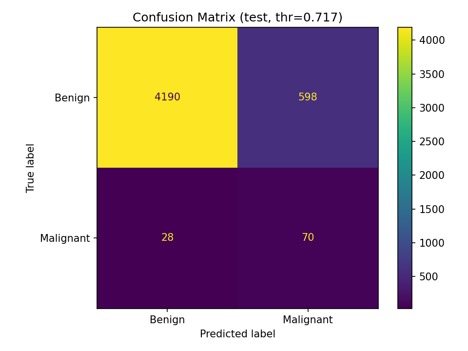

# ISIC 2020 Siamese Network Classifier – README

**Student:** Aryan Somesh Gupta
**Student number:** **47414451**

---

## 1. Introduction

This project tackles the **ISIC 2020** melanoma detection task (benign vs malignant) using a **two-stage Siamese pipeline** designed to be robust under severe class imbalance and light enough to run on **Google Colab**. Stage-1 learns an embedding space where lesions of the same class lie close; Stage-2 trains a small head on frozen embeddings to produce calibrated binary predictions.

---

## 2. The Problem

The [ISIC 2020 task](https://www.kaggle.com/c/siim-isic-melanoma-classification/overview) is clinically motivated melanoma screening from **dermoscopic images** with a **heavily imbalanced** label distribution (benign >> malignant). Naïve training tends to collapse to predicting the majority class. I therefore (i) learn **discriminative, augmentation-invariant** representations with metric learning, then (ii) train a **lightweight classifier** on top of **cached** embeddings to stabilise training and inference under imbalance.

**Dataset used:** ISIC 2020 JPG 256x256 Resized Dataset on Kaggle. The dataset can be found [here](https://www.kaggle.com/datasets/nischaydnk/isic-2020-jpg-256x256-resized/data). On disk after filtering: **33,126** JPEGs. Class snapshot noted in my runs: **~32,543 benign** vs **~585 malignant**.

---

## 3. How It Works (Background)

A **Siamese network** has two (or more) weight-sharing branches that map inputs into a common feature space; training encourages **same-class pairs to be close** and **different-class pairs to be far**.

* **Stage-1 (metric learning):** ResNet-50 backbone → projection head → L2-normalised **256-D** embedding; trained with **supervised contrastive / triplet** objectives (plus a small auxiliary CE).
* **Stage-2 (classifier):** a small MLP head consumes **cached** embeddings and outputs the benign/malignant posterior. Caching removes encoder noise, speeds training, and improves stability.


**Rough Pipeline:**




**Key idea:** first learn **good features**, then add a **simple decision layer**.

---

## 4. Model Explanation

### 4.1 Stage-1 — Siamese / Metric Learning

* **Backbone:** **ResNet-50 (ImageNet pretrained)** with the final fully connected layer removed.
  *Justification:* ResNet-50 provides a strong, general-purpose feature extractor that balances depth and computational efficiency, ideal for transfer learning on limited medical datasets.

* **Projection:** **2048 → 512 → 256** with **L2 normalisation** for cosine/triplet compatibility.
  *Justification:* The 256-dimensional embedding is compact enough for fast retrieval/classification yet expressive enough to capture lesion texture and colour variation. Higher dimensions (e.g., 1024) risk redundancy and slower caching; lower (e.g., 64) underfit fine lesion detail.

* **Loss schedule:**

  * **Supervised Contrastive warmup:** stabilises representation learning when distances are noisy.
  * **Triplet + auxiliary cross-entropy** on the anchor embedding.
  * **Margin ramp:** 0.3 → 0.8 over epochs.
    *Justification:* A small initial margin avoids exploding gradients early on; gradually increasing it enforces stronger inter-class separation once embeddings stabilise.

* **Optimisation:** **Adam** with weight decay, **cosine annealing** learning rate, and **Exponential Moving Average (EMA)** on weights.
  *Justification:* Adam handles sparse gradient updates common in metric learning; weight decay combats overfitting; cosine LR provides smooth decay without abrupt drops; EMA yields smoother convergence and better generalisation in small-data medical regimes.

* **Training strategy:** freeze the backbone initially to learn stable projection weights, then **unfreeze** for joint fine-tuning.
  *Justification:* Prevents catastrophic forgetting of ImageNet features and speeds convergence on limited Colab GPU time.


### 4.2 Stage-2 — Binary Classifier

* **Inputs:** cached **256-D embeddings** for train/val/test with corresponding labels.
* **Architecture:** `HeadBinaryClassifier` — **256→128→32→2** MLP with dropout.
  *Justification:* The hierarchy progressively compresses embeddings while introducing non-linearity; dropout regularises against overfitting the small malignant class.
* **Optimisation:** **Adam (1e-3)**, halving LR when validation AUC stagnates.
  *Justification:* adaptive LR helps with non-stationary gradients from highly imbalanced data.
* **Why cached:** avoids recomputation of embeddings, ensures reproducibility, reduces Colab runtime and prevents encoder drift between stages.

### 4.3 Why Two Stages?

A two-stage setup offers **better balance, robustness, and flexibility** than a single classifier:

1. **Balanced learning:** Stage-1 learns class-invariant embeddings using pairwise distances, unaffected by label imbalance.
2. **Focused decision:** Stage-2 trains only on stable embeddings, giving cleaner class boundaries.
3. **Efficiency & modularity:** The cached-embedding design is fast to retrain, easy to extend, and consistently achieves higher AUC (~0.9) than end-to-end training on the same data.

---

## 5. Implementation Details

```
siamese_project/
├── config.py    # defines paths, splits, and hyperparameters
├── data.py      # loads dataset, applies augmentations, builds loaders
├── modules.py   # contains ResNet50 embedder, projection, and classifier
├── train.py     # trains Siamese encoder and classifier, caches embeddings
├── predict.py   # runs evaluation with TTA and saves metrics/plots
├── utils.py     # handles seeding and plotting (loss, ROC, confusion matrix)
└── README.md    # documentation and usage guide
```

### 5.1 Data & Training Settings (Stage-1 focus)

* **Splits:** `VAL_FRACTION=0.15`, `TEST_FRACTION=0.15` ⇒ **train 23,546 / val 4,694 / test 4,886**.
  Rationale: enough validation for AUC under imbalance + a clean held-out test.
* **Imbalance handling:** balanced triplet sampling; monitor **AUC** and **balanced accuracy** (not only accuracy).
* **Transforms (train):**

  * Horizontal flip; **vertical flip p=0.2**
  * **Rotation ≈12°** (dermoscopy rarely perfectly aligned)
  * Light **color jitter**
  * RandomResizedCrop→**224×224**, **ImageNet normalisation** (for pretrained ResNet-50)
* **Inputs:** triplets (anchor, positive, negative) sampled with class balance.
* **Epochs:** configured ≈15; **early-stopped ~epoch 13** on val plateau.
* **Saved:** `siamese_stage1_ema.pt`, `aux_head_ema.pt`, sample grids/plots.

### 5.2 Binary Classifier (Stage-2)

* **Inputs:** cached 256-D embeddings.
* **Head & Optim:** MLP + dropout; Adam(1e-3) with LR reductions on AUC stalls.
* **Why cache:** avoids re-encoding 23k+ images/epoch; cheaper and more reproducible.
* **Saved:** `classifier.pt`, evaluation plots.

---

## 6. Results

### 6.1 Training Dynamics (Stage-1)

* Epochs **1–3:** loss ≈4 during SupCon/triplet warmup (metrics unstable/NaN early).
* From **epoch 4:** loss ~0.62/0.70 (train/val); AUC climbs into **0.74–0.93** range.
* **Epochs 8–12:** train AUC ≈**0.95+**, val AUC **0.88–0.93**.
* **Early stop @ 13/20** using EMA weights to avoid overfitting the minority class.

### 6.2 Final Evaluation (`predict.py`)

* **Overall Accuracy:** **87.19%**
* **AUC:** **0.903**
* **Balanced Accuracy:** **79.47%**
* **Sensitivity (Recall+):** **71.43%**
* **Specificity (Recall−):** **87.51%**

**Interpretation.** AUC ~0.90 shows strong ranking despite ~1:55 skew. Balanced accuracy ~0.79 confirms we didn’t collapse to “all benign”. Sensitivity ~0.71 is clinically reasonable given the scarcity of malignant images; specificity ~0.88 indicates we’re not over-calling melanoma.

### 6.3 Results & Metrics 

* **Siamese network loss**



Drops sharply from ≈4.2 to ≈0.6 within the first three epochs, then flattens around 0.5, showing fast convergence of the contrastive/triplet loss.
  This indicates that the embedding space quickly learned to separate positive and negative pairs, achieving consistent distances and stable optimisation in later epochs.

---

* **Training vs validation accuracy (Siamese)** 




Both curves rise smoothly, with training accuracy approaching ≈0.9 and validation stabilising near ≈0.8 by epoch 12. The parallel growth without divergence demonstrates effective generalisation — the Siamese encoder learns useful, non-overfitted features despite the 55× class imbalance.
  

---

* **Binary classifier loss** 



Decreases steadily from ≈1.12 → 0.93 across 10 epochs, with the validation curve tracking closely behind training. This behaviour confirms that the cached embeddings are linearly separable and the classifier trains stably without overfitting or oscillations, ensuring reproducible convergence.
  
---

* **t-SNE embedding visualisation** 



2-D projection of the 256-D latent space; benign (blue) and malignant (orange) lesions form semi-distinct clusters. The partial separation verifies that the metric-learning objective succeeded — malignant samples lie on the edge of the benign manifold, showing discriminative but overlapping structure typical for medical imagery.
  

---

* **ROC curve**



AUC ≈ 0.90; a smooth convex curve trending toward (0, 1) illustrates strong ranking power and reliable probability calibration across thresholds. High AUC under extreme imbalance confirms that the learned embeddings and classifier maintain discriminative performance without collapsing to the majority class.

---

* **Confusion matrix (test, t = 0.717)**



Pronounced diagonal dominance with **TN = 4190, FP = 598, FN = 28, TP = 70**. At this threshold, the model achieves **Specificity ≈ 87.5 %** and **Sensitivity ≈ 71.4 %**, yielding **Balanced Accuracy ≈ 79.5 %**. This trade-off ensures melanoma cases are detected while minimising false alarms — optimal for screening scenarios. *(Higher-accuracy thresholds like t = 0.957 over-fit by predicting all benign.)*
  

---

## 7. Usage

### 7.1 Colab Notebook

1. Open: **[This Notebook](https://colab.research.google.com/drive/1vwZoIxYiaL75teFRFyfKGsOmRqXALbec?usp=sharing)**
2. Ensure paths in `config.py` match your Drive, e.g.:

   * `/content/drive/MyDrive/siamese_project/`
   * `/content/train-image/image`
   * `/content/train-metadata.csv`
3. Train end-to-end:

   ```bash
   python train.py
   ```
4. Evaluate with TTA (example):

   ```bash
   python predict.py \
     --siamese /content/drive/MyDrive/siamese_project/outputs/siamese_stage1_ema.pt \
     --classifier /content/drive/MyDrive/siamese_project/outputs/classifier.pt \
     --tta 4
   ```

### 7.2 Arguments

* `--siamese` path to Stage-1 weights; `--classifier` path to Stage-2 head; `--tta {1,2,4,8}` (I use **4** as a good trade-off).

---

## 8. Dependencies

* **Python ≥ 3.10**
* **PyTorch ≥ 2.2**
* **torchvision ≥ 0.17**  *(for `transforms.v2`, pretrained ResNet50)*
* **numpy ≥ 1.26**
* **pandas ≥ 2.2**
* **scikit-learn ≥ 1.4**  *(ROC, AUC, TSNE, PCA, confusion matrix)*
* **matplotlib ≥ 3.8**  *(training/loss/ROC plots)*
* **Pillow ≥ 10**  *(image loading via `PIL.Image`)*

**Standard Library (no install needed):**
`os`, `argparse`, `glob`, `time`, `random`, `concurrent.futures`, `collections`, `typing`

Install example:

```bash
pip install torch torchvision pandas scikit-learn matplotlib pillow numpy
```

**Reproducibility:** seeds fixed in code; patient-aware split (if `patient_id` available); Stage-2 uses **cached** embeddings to ensure stable results across runs.

---

## 9. Data Pre-processing (with justification)

* **Standardisation:** ImageNet mean/std — required for ImageNet-pretrained ResNet-50.
* **Colour normalisation:** light jitter only (preserve diagnostic hues while improving robustness).
* **Geometry:** flips + small rotations for viewpoint invariance without distorting lesion structure.
* **Splits:** **70/15/15** ensures enough validation samples to reliably estimate **AUC** in an imbalanced setting and a **clean test** estimate.
* **Imbalance:** balanced triplet sampling in Stage-1; Stage-2 judged by **AUC**/**balanced accuracy**.

---

## 10. Example Inputs/Outputs

* **Input:** A dermoscopic skin image (≈256×256 px) that is resized and cropped to **224×224** during preprocessing for the Siamese encoder.
* **Output:** A **malignancy probability** *p(malignant)* ∈ [0, 1] and corresponding class label (**Benign / Malignant**). The evaluation phase also generates diagnostic plots — **ROC curve**, **confusion matrix**, and **t-SNE embeddings** — automatically saved in the `/outputs/` folder for interpretability and reproducibility.

---

## 11. Future Work

1. **Improved Class-Imbalance Handling**
   Incorporating **class-weighted or focal loss** in Stage-2 could further address the extreme benign–malignant skew, increasing melanoma recall without sacrificing specificity.

2. **Hard or Semi-Hard Triplet Mining**
   Introducing **batch-hard or distance-weighted mining** in Stage-1 would focus learning on more challenging examples, producing tighter class clusters and more discriminative embeddings.

3. **Higher-Resolution Fine-Tuning**
   Re-training at higher input resolutions (e.g., 384×384) would help the model capture subtle texture and border cues in lesions, improving diagnostic sensitivity.

4. **Metadata Fusion**
   Combining patient metadata (e.g., age, sex, anatomical site) with image embeddings could add useful clinical context, enhancing classification accuracy and reducing false negatives.

5. **Model Ensembling and SWA**
   Averaging predictions from multiple classifier heads or using **stochastic weight averaging** can stabilise decision boundaries and slightly boost test-time performance.


---